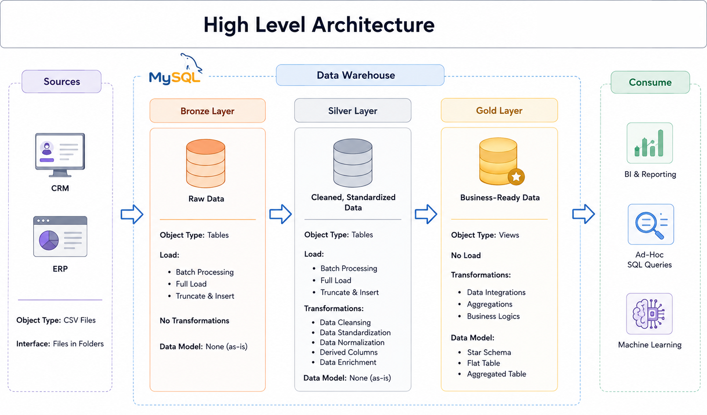

# MySQL Data Warehouse and Analytics Project

This project is a modern data warehousing and analytics solution built with MySQL. It follows a medallion architecture to ingest, clean, model, and analyze business data from multiple source systems, with a focus on sales and customer intelligence.

The goal is to turn raw operational data into trusted, analytics-ready datasets that support reporting, business analysis, and decision-making.

---

## 🏗️ Architecture Overview

The solution is organized across three layers:

1. **Bronze Layer**  
   Stores raw data as it is received from source systems. CSV files are loaded into MySQL with minimal transformation so the original source is preserved.

2. **Silver Layer**  
   Cleans, standardizes, and enriches the data. This layer resolves inconsistencies, normalizes fields, and prepares the dataset for analytical modeling.

3. **Gold Layer**  
   Creates business-ready analytical tables designed for reporting and dashboarding. This layer is optimized for star-schema-style queries and KPI analysis.

---

## 📌 Project Objective

The project demonstrates how to build a scalable, practical data warehouse using MySQL to consolidate data from CRM and ERP sources into a single analytical model.

Key objectives include:

- Ingest raw CSV datasets into a relational warehouse
- Clean and validate data quality across source systems
- Model structured fact and dimension tables for analysis
- Support business reporting with SQL-based queries
- Highlight end-to-end data engineering practices in a portfolio-ready format

---

## 🧩 Data Sources

The project uses source data from two domains:

- **ERP**: product, location, and operational data
- **CRM**: customer and sales-related information

These datasets are loaded into the warehouse and combined into a unified data model for analytical use.

---

## ⚙️ ETL Workflow

The project follows a standard warehouse pipeline:

1. Load raw files into the Bronze layer in MySQL
2. Validate and clean incoming records in the Silver layer
3. Create curated tables and metrics in the Gold layer
4. Run analytical SQL queries to uncover customer, product, and sales insights

This workflow reflects common industry practices for data engineering and BI enablement.

---

## 📊 Business Use Cases

The analytical layer supports questions such as:

- Which customers are driving the most revenue?
- What products perform best over time?
- How do sales trends vary by geography or customer segment?
- Which records need cleaning or validation before reporting?

These insights help stakeholders understand performance and support strategic decisions.

---

## 🧠 Skills Demonstrated

This repository is suitable for showcasing expertise in:

- SQL development
- Data warehousing
- ETL pipeline design
- Data modeling
- Data quality management
- Data analytics and reporting

---

## 🚀 MySQL Setup Notes

This project is designed for MySQL as the warehouse database engine. The scripts in the repository are intended to be executed in a MySQL environment to create the database objects and load the transformation logic.

Typical workflow:

1. Create the database using the initialization script
2. Run the Bronze layer scripts to load raw data
3. Execute the Silver layer transformation logic
4. Build the Gold analytical tables
5. Query the final business-ready models for reporting

For more detailed requirements and project documentation, see the related files in the docs and scripts folders.